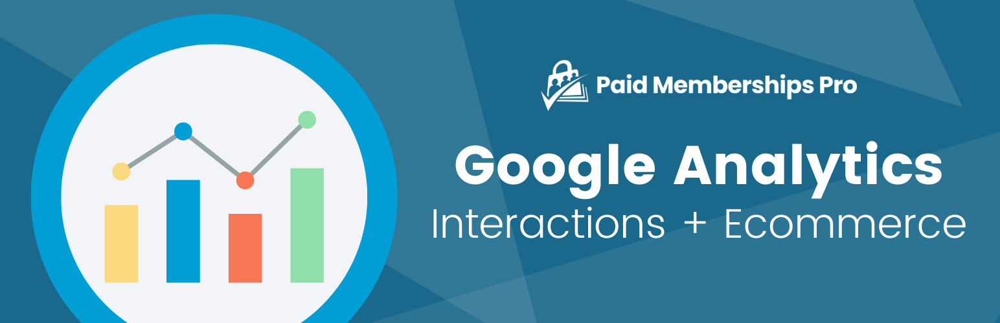

# [Paid Memberships Pro - Google Analytics](https://www.paidmembershipspro.com/add-ons/google-analytics) #
[comment]: # (Generate badges from shields.io, only works for .org plugins to get other stats etc. We'd have to create our own endpoints for Premium plugins)

### Welcome to the Paid Memberships Pro - Google Analytics GitHub Repository
This pluing connects your membership site to Google Analytics to measure traffic and interactions across your website, as well as ecommerce conversions (new memberships and subscriptions) across the checkout experience.

For more information please visit [paidmembershipspro.com/add-ons/google-analytics](https://www.paidmembershipspro.com/add-ons/google-analytics)

## Installation ##
For detailed installation steps, visit the [documentation](https://www.paidmembershipspro.com/add-ons/google-analytics) page.

1. Download the current development ZIP file directly: `https://github.com/strangerstudios/pmpro-google-analytics/archive/dev.zip`

**Please ensure that once installing this version of the plugin to remove `-dev` from the plugin's folder name.**

## Bugs ##
If you find an issue/bug, let us know by [creating a detailed GitHub issue](https://github.com/strangerstudios/pmpro-google-analytics/issues/new).

## Support ##
This is a developer's portal for Paid Memberships Pro - Google Analytics. We do not offer support on this channel. **Any support related questions should be directed to [paidmembershipspro.com/support](https://www.paidmembershipspro.com/support).**

## Contributing to Paid Memberships Pro - Google Analytics ##
We encourage and welcome any contribution to Paid Memberships Pro - Google Analytics. Please read the [guidelines for contributing](https://github.com/strangerstudios/paid-memberships-pro/blob/dev/.github/CONTRIBUTING.md) to this repository.

There are various **ways to the help development** of Paid Memberships Pro - Google Analytics:

1. Report [bugs/issues](https://github.com/strangerstudios/pmpro-google-analytics/issues/new) on GitHub.
2. Work on any issues by submitting a Pull Request.

Here are some ways for **non-developers to contribute** to Paid Memberships Pro - Google Analytics:

1. Translate Paid Memberships Pro - Google Analytics into your own [language](https://www.paidmembershipspro.com/paid-memberships-pro-in-your-language/).
2. [Purchase a paid membership](https://paidmembershipspro.com/pricing) to help fund ongoing development and bug fixes.
